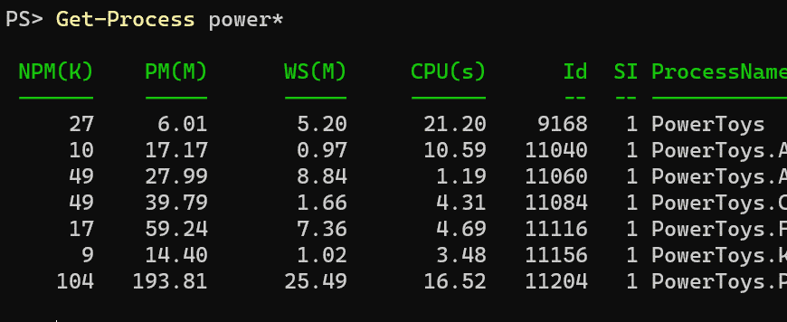
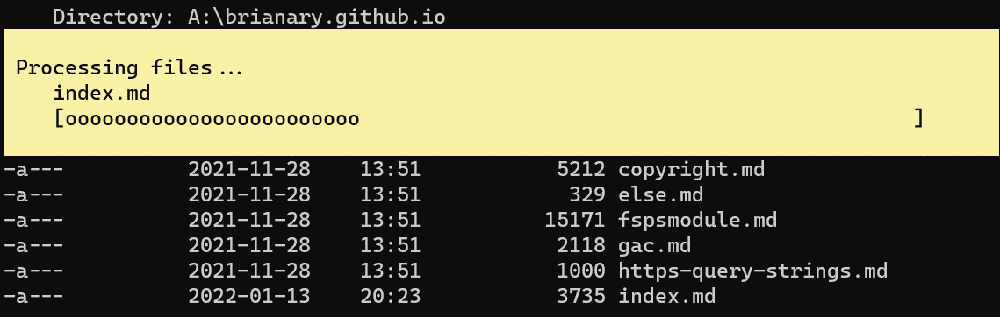

Windows PowerShell (WPS) to PowerShell Core (PSC)
=================================================

- [Windows PowerShell (WPS) to PowerShell Core (PSC)](#windows-powershell-wps-to-powershell-core-psc)
  - [`New-WebServiceProxy`](#new-webserviceproxy)
  - [`Get-WmiObject`](#get-wmiobject)
    - [WMI in WPS](#wmi-in-wps)
    - [CIM in PSC](#cim-in-psc)
    - [Some examples of WMI to CIM classes](#some-examples-of-wmi-to-cim-classes)
  - [`Set-Clipboard -AsHtml`](#set-clipboard--ashtml)
  - [`Invoke-WebRequest -UseBasicParsing:$false`](#invoke-webrequest--usebasicparsingfalse)
  - [ANSI colors and `Out-String`](#ansi-colors-and-out-string)
    - [_power-proc.txt_](#power-proctxt)
  - [`Write-Progress` and `$PSStyle`](#write-progress-and-psstyle)
  - [`System.Configuration.ConfigurationManager`](#systemconfigurationconfigurationmanager)
    - [Windows PowerShell ConfigurationManager](#windows-powershell-configurationmanager)
    - [PowerShell Core ConfigurationManager](#powershell-core-configurationmanager)
      - [machine.config](#machineconfig)
      - [exe.config (none)](#execonfig-none)
      - [exe.config (roaming)](#execonfig-roaming)
      - [exe.config (local)](#execonfig-local)

There are certain gaps when moving from Windows PowerShell (5.x) to the new cross-platform PowerShell Core (6+),
due to features that relied on Windows-specific infrastructure. Here are a few notable things that are no longer
supported, with some possible workarounds (which will mostly still work only on Windows, because they were
Windows-specific features to start with).

WPS is `powershell.exe`, and is entirely independent of PSC, which is `pwsh.exe`. You can still use both, but
future development efforts will be focused on PSC.

`New-WebServiceProxy`
---------------------

In WPS, you could create a proxy class with only a WSDL URL that described a SOAP service, and you'd have access
to that web service's calls as methods on that class.

In PSC, you'll have to use `Invoke-RestMethod` for each call, manually creating the SOAP envelope and serializing
the parameters into it before sending it as the request body (be sure to XML-encode any strings!).
You can often see [what the SOAP envelope looks like][soap] from the WSDL.

```powershell
$response = Invoke-RestMethod https://www.w3schools.com/xml/tempconvert.asmx `
    -Method Post `
    -ContentType 'text/xml; charset=utf-8' `
    -Headers @{SOAPAction='https://www.w3schools.com/xml/FahrenheitToCelsius'} `
    -Body @"
<?xml version="1.0" encoding="utf-8"?>
<soap:Envelope xmlns:xsi="http://www.w3.org/2001/XMLSchema-instance"
  xmlns:xsd="http://www.w3.org/2001/XMLSchema"
  xmlns:soap="http://schemas.xmlsoap.org/soap/envelope/">
  <soap:Body>
    <FahrenheitToCelsius xmlns="https://www.w3schools.com/xml/">
      <Fahrenheit>$degrees</Fahrenheit>
    </FahrenheitToCelsius>
  </soap:Body>
</soap:Envelope>
"@
```

then deserializing the response body:

```powershell
$value = Select-Xml '/soap:Envelope/soap:Body/*/*/text()' $response `
    -Namespace @{soap='http://schemas.xmlsoap.org/soap/envelope/'} |
    foreach {$_.Node.Value}
# additional parsing of $value may be necessary, depending on the SOAP method
```

This process obviously becomes more work depending on the parameter and response data structures.

See [SOAP support in all platforms · Issue #9838 · PowerShell/PowerShell][issue9838]

[soap]: https://www.w3schools.com/xml/tempconvert.asmx?op=FahrenheitToCelsius "FahrenheitToCelsius"
[issue9838]: https://github.com/PowerShell/PowerShell/issues/9838

`Get-WmiObject`
---------------

Windows Management Instrumentation (WMI) allows querying system details like hardware info, but it uses
an old Windows-specific protocol that has been supplanted by the newer Common Information Model (CIM).
PSC no longer supports WMI, in favor of CIM.

### WMI in WPS

```powershell
Get-WmiObject Win32_PhysicalMemory |
    foreach {"$($_.BankLabel) $($_.Tag) $($_.Capacity / 1GB)GB"}
```

```txt
BANK 0 Physical Memory 0 16GB
BANK 0 Physical Memory 1 16GB
```

### CIM in PSC

```powershell
Get-CimInstance CIM_PhysicalMemory |
    foreach {"$($_.BankLabel) $($_.Tag) $($_.Capacity / 1GB)GB"}
```

```txt
BANK 0 Physical Memory 0 16GB
BANK 0 Physical Memory 1 16GB
```

Many WMI "classes" have direct analogs, a few do not.

### Some examples of WMI to CIM classes

| WMI class             | CIM class           |
| --------------------- | ------------------- |
| Win32_ComputerSystem  | CIM_ComputerSystem  |
| Win32_OperatingSystem | CIM_OperatingSystem |
| Win32_Processor       | CIM_Processor       |
| Win32_StorageVolume   | CIM_StorageVolume   |
| Win32_Share           | *(none)*            |

Use `Get-CimClass` for a list of available classes.

See [about_WMI_Cmdlets][], [CimCmdlets module][], and [Should I use CIM or WMI with Windows PowerShell?][cim-vs-wmi]

[about_WMI_Cmdlets]: https://docs.microsoft.com/powershell/module/microsoft.powershell.core/about/about_wmi_cmdlets "Provides background information about Windows Management Instrumentation (WMI) and Windows PowerShell."
[CimCmdlets module]: https://docs.microsoft.com/powershell/module/cimcmdlets/ "Contains cmdlets that interact with Common Information Model (CIM) Servers like the Windows Management Instrumentation (WMI) service."
[cim-vs-wmi]: https://devblogs.microsoft.com/scripting/should-i-use-cim-or-wmi-with-windows-powershell/ "Richard Siddaway explains the differences between the CIM cmdlets and the WMI cmdlets, and details use cases."

`Set-Clipboard -AsHtml`
-----------------------

In WPS, you could copy content as formatted HTML, so you could paste it anywhere that accepted formatted text
like emails, messenger applications, documents, &c. This was really nice when paired with `ConvertTo-Html`.

This required some Windows-specific features, so it has been removed in PSC.

Maybe the easiest workaround is to set the clipboard text in PSC with `Set-Clipboard`, and then call WPS from PSC:

```powershell
powershell.exe -NoProfile -NonInteractive -Command "Get-Clipboard |Set-Clipboard -AsHtml"
```

or, more concisely:

```powershell
powershell -nop -noni -c "gcb |scb -ash"
```

`Invoke-WebRequest -UseBasicParsing:$false`
-------------------------------------------

In WPS, the default behavior of `Invoke-WebRequest` was to parse the response using a hosted version of Internet Explorer,
unless `-UseBasicParsing` was specified (`-UseBasicParsing:$false` explicitly disables this behavior). Arguably this default
was backwards: you'd expect this extra overhead to be enabled upon request.

This featuer was convenient because parsing HTML is much trickier than XML (XHTML sought to combine the two for convenience,
but added a lot more syntax overhead that HTML5 was in part a reaction against), and having access to the full DOM of parsed
HTML also allowed for sophisticated querying.

PSC has discontinued support for this feature entirely, even though the parameter still exists for (misleading)
backwards-compatibility.

One simple potential workaround is to use the `HTMLFile` COM component, which is just another way to get at the Internet
Explorer DOM.

```powershell
$dom = New-Object -ComObject HTMLFile
$dom.write(([Text.Encoding]::Unicode.GetBytes($html)))
```

👉 Note: The `HTMLFile` COM component (ActiveX control) tends to ignore any invisible content, and can fail to parse
complex content entirely. You may need to manually strip `<script>` elements, for example.

ANSI colors and `Out-String`
----------------------------



By default PSC now displays colorful headers using standard ANSI terminal escape sequences.
The new [`$PSStyle`][] object controls these colors and styles.

However, these ANSI escape sequences can sometimes produce unwanted results:

```powershell
@"
Power* Processes
================
$(Get-Process power* |Out-String)
"@ |Out-File power-proc.txt

```

### _power-proc.txt_

```txt
Power* Processes
================

␛[32;1m NPM(K)    PM(M)      WS(M)     CPU(s)      Id  SI ProcessName␛[0m
␛[32;1m ------    -----      -----     ------      --  -- -----------␛[0m
     27     6.01       5.10      24.22    9168   1 PowerToys
     10    17.17       0.97      11.52   11040   1 PowerToys.AlwaysOnTop
     50    28.09       6.53       1.19   11060   1 PowerToys.Awake
     50    39.95      15.74       4.75   11084   1 PowerToys.ColorPickerUI
     17    59.24       7.35       5.02   11116   1 PowerToys.FancyZones
      9    14.40       1.03       3.97   11156   1 PowerToys.KeyboardManagerEngine
    104   197.88      82.94      17.06   11204   1 PowerToys.PowerLauncher
```

Unless this file is intended purely for output directly to the terminal, you probably don't want those ANSI
escape codes there.

<!--
Perhaps the best way to disable ANSI codes would be with the [`NO_COLOR`][] environment variable, which can
be set for the scope of the running process, is cross-platform, and applies to several external apps as well.
You can also use the `TERM` environment variable:

```powershell
$env:NO_COLOR = $true
$env:TERM = 'xterm-mono' # equivalent for PowerShell, but may differ for external programs
```
-->

PSC supports other ways of suppressing ANSI codes by directly setting `$PSStyle.OutputRendering = 'PlainText'`,
but `$PSStyle` doesn't seem to be scoped as locally (it's a global singleton). Setting it to `Host` will disable
colors only for piped or redirected text.

See [about_ANSI_Terminals: Disabling ANSI output][disable-ansi]

[`$PSStyle`]: https://docs.microsoft.com/powershell/module/microsoft.powershell.core/about/about_ansi_terminals#psstyle "A global singleton variable for controlling ANSI terminal colors and styles."
[disable-ansi]: https://docs.microsoft.com/powershell/module/microsoft.powershell.core/about/about_ansi_terminals#disabling-ansi-output "Support for ANSI escape sequences can be turned off using the TERM or NO_COLOR environment variables."
[`NO_COLOR`]: https://no-color.org/ "An informal standard to suppress color output."

`Write-Progress` and `$PSStyle`
-------------------------------

The new default style for `Write-Progress` in PSC is compact and inline ("Minimal"):


To use the banner across the top of the terminal, WPS-style, you have to set the view:

```powershell
$PSStyle.Progress.View = 'Classic'
```



See [about_ANSI_Terminals][], under `$PSStyle.Progress`

[about_ANSI_Terminals]: https://docs.microsoft.com/powershell/module/microsoft.powershell.core/about/about_ansi_terminals "PowerShell has many features that support the use of ANSI escape sequences to control the rendering of output in the terminal application that is hosting PowerShell."

`System.Configuration.ConfigurationManager`
-------------------------------------------

The old XML-based config files that drove the .NET Framework Configuration system aren't really used anymore after .NET Core.

### Windows PowerShell ConfigurationManager

The _machine.config_ has to exist, and could be relied on for looking up `system.net` info, or system-width definitions of
database connection strings.

```powershell
Add-Type -AN Add-Type -AN System.Configuration.ConfigurationManager # a new assembly in .NET Core and later
using namespace System.Configuration
[ConfigurationManager]::AppSettings
[ConfigurationManager]::ConnectionStringsSystem.Configuration
using namespace System.Configuration
${machine.config} = [ConfigurationManager]::OpenMachineConfiguration().FilePath
${exe.config~none} = [ConfigurationManager]::OpenExeConfiguration([ConfigurationUserLevel]::None).FilePath
${exe.config~local} = [ConfigurationManager]::OpenExeConfiguration([ConfigurationUserLevel]::PerUserRoamingAndLocal).FilePath
${exe.config~roaming} = [ConfigurationManager]::OpenExeConfiguration([ConfigurationUserLevel]::PerUserRoaming).FilePath
Get-Variable *.config* |
    select Name,
        @{n='FilePath';e={(Compress-EnvironmentVariables.ps1 $_.Value) -replace 'DefaultDomain_Path_\w+','DefaultDomain_Path_*'}},
        @{n='Exists';e={Test-Path $_.Value -Type Leaf}}
```

On a Windows 10 machine:

```txt
Name               FilePath                                                                           Exists
----               --------                                                                           ------
exe.config~local   %LOCALAPPDATA%\Microsoft_Corporation\DefaultDomain_Path_*\10.0.19041.1\user.config   True
exe.config~none    %SystemRoot%\system32\windowspowershell\v1.0\powershell.exe.Config                   True
exe.config~roaming %APPDATA%\Microsoft_Corporation\DefaultDomain_Path_*\10.0.19041.1\user.config       False
machine.config     %SystemRoot%\Microsoft.NET\Framework64\v4.0.30319\Config\machine.config              True
```

On a Windows 11 machine:

```txt
Name               FilePath                                                                           Exists
----               --------                                                                           ------
exe.config~local   %LOCALAPPDATA%\Microsoft_Corporation\DefaultDomain_Path_*\10.0.22000.1\user.config  False
exe.config~none    %SystemRoot%\System32\WindowsPowerShell\v1.0\powershell.exe.Config                   True
exe.config~roaming %APPDATA%\Microsoft_Corporation\DefaultDomain_Path_*\10.0.22000.1\user.config       False
machine.config     %SystemRoot%\Microsoft.NET\Framework64\v4.0.30319\Config\machine.config              True
```

You can grab some system-width settings, given these mail settings in _machine.config_.

```xml
<configuration>
    <!-- ... -->
    <system.net>
        <mailSettings>
            <smtp deliveryFormat="SevenBit" deliveryMethod="Network" from="nobody@example.org">
                <network host="smtp.example.org" port="25" enableSsl="true" />
            </smtp>
        </mailSettings>
    </system.net>
    <!-- ... -->
</configuration>
```

Querying for system-wide mail settings is easy.

```powershell
[ConfiguratioAdd-Type -AN System.Configuration.ConfigurationManager # a new assembly in .NET Core and later
using namespace System.Configuration
[ConfigurationManager]::AppSettings
[ConfigurationManager]::ConnectionStringsnManager]::GetSection('system.net/mailSettings/smtp')
```

```txt
DeliveryMethod           : SpecifiedPickupDirectory
DeliveryFormat           : SevenBit
From                     : nobody@example.org
Network                  : System.Net.SmtpNetworkElement
SpecifiedPickupDirectory : System.Net.SmtpSpecifiedPickupDirectoryElement
SectionInformation       : System.SectionInformation
LockAttributes           : {}
LockAllAttributesExcept  : {}
LockElements             : {}
LockAllElementsExcept    : {}
LockItem                 : False
ElementInformation       : System.ElementInformation
CurrentConfiguration     :
```

Including system-wide connection string definitions.

```powershell
[ConfiguratioAdd-Type -AN System.Configuration.ConfigurationManager # a new assembly in .NET Core and later
using namespace System.Configuration
[ConfigurationManager]::AppSettings
[ConfigurationManager]::ConnectionStringsnManager]::ConnectionStrings
```

```txt
Name                    : LocalSqlServer
ConnectionString        : data source=.\SQLEXPRESS;Integrated Security=SSPI;AttachDBFilename=|DataDirectory|aspnetdb.mdf;User Instance=true
ProviderName            : System.Data.SqlClient
LockAttributes          : {}
LockAllAttributesExcept : {}
LockElements            : {}
LockAllElementsExcept   : {}
LockItem                : False
ElementInformation      : System.ElementInformation
CurrentConfiguration    :
```

### PowerShell Core ConfigurationManager

You can't rely on the existence of the venerable, system-wide _machine.config_ anymore.
Note that below, the returned location for _machine.config_ is PowerShell-specific, so there is little
practical difference between PowerShell's _machine.config_ and PowerShell's non-user "exe.config".
This means there's no longer any truly system-wide way of sharing settings between web apps, web APIs, scripts,
console/desktop apps, &c.

```powershell
Add-Type -AN Add-Type -AN System.Configuration.ConfigurationManager # a new assembly in .NET Core and later
using namespace System.Configuration
[ConfigurationManager]::AppSettings
[ConfigurationManager]::ConnectionStringsSystem.Configuration.ConfigurationManager # a new assembly in .NET Core and later
using namespace System.Configuration
${machine.config} = [ConfigurationManager]::OpenMachineConfiguration().FilePath
${exe.config~none} = [ConfigurationManager]::OpenExeConfiguration([ConfigurationUserLevel]::None).FilePath
${exe.config~local} = [ConfigurationManager]::OpenExeConfiguration([ConfigurationUserLevel]::PerUserRoamingAndLocal).FilePath
${exe.config~roaming} = [ConfigurationManager]::OpenExeConfiguration([ConfigurationUserLevel]::PerUserRoaming).FilePath
Get-Variable *.config* |
    select Name,
        @{n='FilePath';e={(Compress-EnvironmentVariables.ps1 $_.Value) -replace 'pwsh_StrongName_\w+','DefaultDomain_Path_*'}},
        @{n='Exists';e={Test-Path $_.Value -Type Leaf}}
```

The results one Windows 10 machine:

```txt
Name               FilePath                                                                        Exists
----               --------                                                                        ------
exe.config~local   %LOCALAPPDATA%\Microsoft_Corporation\DefaultDomain_Path_*\7.2.1.500\user.config  False
exe.config~none    %ProgramFiles%\PowerShell\7\pwsh.dll.config                                      False
exe.config~roaming %APPDATA%\Microsoft_Corporation\DefaultDomain_Path_*\7.2.1.500\user.config       False
machine.config     %ProgramFiles%\PowerShell\7\Config\machine.config                                False
```

On another machine, the `exe.config~local` file exists, but only contains some help window geometry settings.

Even though it doesn't throw the promised `ConfigurationErrorsException` if the file can't be loaded.

```powershell
[ConfiguratioAdd-Type -AN System.Configuration.ConfigurationManager # a new assembly in .NET Core and later
using namespace System.Configuration
[ConfigurationManager]::AppSettings
[ConfigurationManager]::ConnectionStringsnManager]::GetSection('system.net/mailSettings/smtp') -eq $null
```

```txt
True
```

But the connection strings still seem to exist, though I'm not yet sure where this one is coming from.

```powershell
[ConfiguratioAdd-Type -AN System.Configuration.ConfigurationManager # a new assembly in .NET Core and later
using namespace System.Configuration
[ConfigurationManager]::AppSettings
[ConfigurationManager]::ConnectionStringsnManager]::ConnectionStrings
```

```txt
Name                    : LocalSqlServer
ConnectionString        : data source=.\SQLEXPRESS;Integrated Security=SSPI;AttachDBFilename=|DataDirectory|aspnetdb.mdf;User Instance=true
ProviderName            : System.Data.SqlClient
LockAttributes          : {}
LockAllAttributesExcept : {}
LockElements            : {}
LockAllElementsExcept   : {}
LockItem                : False
ElementInformation      : System.ElementInformation
CurrentConfiguration    :
```

A _machine.config_ file can be created and populated with settings, but without the .NET Framework config classes,
you can't just copy a `system.net` section from your .NET 4.8 _machine.config_, since those assemblies aren't available in .NET Core.
You can nearly adapt the mail settings by defining the structure with `ConfigurationSectionGroup` and `SingleTagSectionHandler`,
but the attributes on the `smtp` element wouldn't be parsed. There doesn't seem to be a way to provide the mail settings in the same
structure for scripting both WPS and PSC. Sections without attributes should be fairly simple to adapt to work for either WPS or PSC.

Adding values to all of the config files shows that not all of them are parsed by `ConfigurationManager`
(though it does replace the default `LocalSqlServer` connection string).

#### machine.config

```xml
<configuration>
    <configSections>
        <section name="appSettings" type="System.Configuration.AppSettingsSection, System.Configuration, Version=4.0.0.0, Culture=neutral, PublicKeyToken=b03f5f7f11d50a3a" restartOnExternalChanges="false" requirePermission="false" />
        <section name="connectionStrings" type="System.Configuration.ConnectionStringsSection, System.Configuration, Version=4.0.0.0, Culture=neutral, PublicKeyToken=b03f5f7f11d50a3a" requirePermission="false" />
    </configSections>
    <appSettings>
        <add key="machine" value="True" />
    </appSettings>
    <connectionStrings>
        <add name="machine" connectionString="Server=(localdb)\ProjectsV13;Database=AdventureWorks2016;Integrated Security=SSPI" providerName="System.Data.SqlClient"/>
    </connectionStrings>
</configuration>
```

#### exe.config (none)

```xml
<configuration>
    <appSettings>
        <add key="exe.none" value="True" />
    </appSettings>
    <connectionStrings>
        <add name="exe.none" connectionString="Server=(localdb)\ProjectsV13;Database=AdventureWorks2016;Integrated Security=SSPI" providerName="System.Data.SqlClient"/>
    </connectionStrings>
</configuration>
```

#### exe.config (roaming)

```xml
<configuration>
    <appSettings>
        <add key="exe.roaming" value="True" />
    </appSettings>
    <connectionStrings>
        <add name="exe.roaming" connectionString="Server=(localdb)\ProjectsV13;Database=AdventureWorks2016;Integrated Security=SSPI" providerName="System.Data.SqlClient"/>
    </connectionStrings>
</configuration>
```

#### exe.config (local)

```xml
<?xml version="1.0" encoding="utf-8"?>
<configuration>
    <appSettings>
        <add key="exe.local" value="True" />
    </appSettings>
    <connectionStrings>
        <add name="exe.local" connectionString="Server=(localdb)\ProjectsV13;Database=AdventureWorks2016;Integrated Security=SSPI" providerName="System.Data.SqlClient"/>
    </connectionStrings>
</configuration>
```

```powershell
[ConfigurationManager]::AppSettings
```

```txt
machine
exe.none
```

```powershell
[ConfigurationManager]::ConnectionStrings
```

```txt
Name                    : machine
ConnectionString        : Server=(localdb)\ProjectsV13;Database=AdventureWorks2016;Integrated Security=SSPI
ProviderName            : System.Data.SqlClient
LockAttributes          : {}
LockAllAttributesExcept : {}
LockElements            : {}
LockAllElementsExcept   : {}
LockItem                : False
ElementInformation      : System.Configuration.ElementInformation
CurrentConfiguration    :

Name                    : exe.none
ConnectionString        : Server=(localdb)\ProjectsV13;Database=AdventureWorks2016;Integrated Security=SSPI
ProviderName            : System.Data.SqlClient
LockAttributes          : {}
LockAllAttributesExcept : {}
LockElements            : {}
LockAllElementsExcept   : {}
LockItem                : False
ElementInformation      : System.Configuration.ElementInformation
CurrentConfiguration    :
```

By default, the user exe.config files don't seem to be included.
